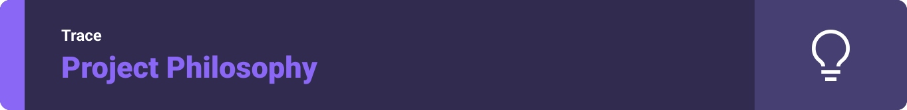
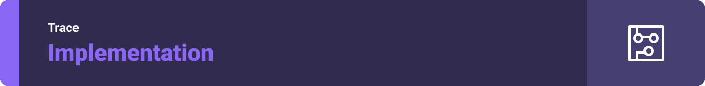

<div align="center">

> A game like social media platform where users can leave their trace behind as posts (image, video, text…) and discover historical chests on the real world map. 


**[PROJECT PHILOSOPHY](https://github.com/HousamKak/trace#-project-philosophy) • [WIREFRAMES](https://github.com/HousamKak/trace#-wireframes) • [TECH STACK](https://github.com/HousamKak/trace#-tech-stack) • [IMPLEMENTATION](https://github.com/HousamKak/trace#-impplementation) • [HOW TO RUN?](https://github.com/HousamKak/trace#-how-to-run)• [FUTURE WORK](https://github.com/HousamKak/trace#-future-work)**

</div>

<br><br>




> We are all drown to stories, and historical ones are the most appealing. But history is not accessable easily to people and a tourist guide is needed at any historical site. Our ancestors left us a lot of stories to consume, and likewise, we can leave our own onsite. Both our ancestor's history and our attendance on a geographical spot is a trace that shall never vanishes, and this app tries to make this a reality.
> 
> This application will allow you to discover historical sites by finding close chests in the area you are located or visit. It will also allow you to leave traces behind. Those traces could be text, music, images, or videos. People who pass by the geographical location of the left trace will be able to check what you have left behind.

### User Stories
- As a user, I want to learn about history, so that I recognize valuable historical sites
- As a user, I want to share text at the location I visit, so that other visitors can check
- As a user, I want to share images at the location I visit, so that other visitors can check
- As a user, I want to share music at the location I visit, so that other visitors can check
- As a user, I want to share videos at the location I visit, so that other visitors can check

<br><br>


> This design was planned before on paper, then moved to Figma app for the fine details.
Note that i didn't use any styling library or theme, all from scratch and using pure css modules

> First I start with the Landing screens

| Log in Page  | Sign In  | Dob Page | Sign Up |
| -----------------| -----|-----|-----|
|  |  |  | 

> Here you can find the Middle Button Menu screens

| Middle Button  | Saved  | My Traces | Friends |
| -----------------| -----|-----|-----|
|  |  |  | 

| Scripts | Items  |
| -----------------| -----| 
|  |  | 

> Here you can find the main screens

| Profile  | Chest  | Image Trace | Video Trace |
| -----------------| -----|-----|-----|
|  |  |  | 

| Main Frame Demo  | Music Trace  | Add Trace | Splash Screen |
| -----------------| -----|-----|-----|
|  |  |  | 


<br><br>


Here's a brief high-level overview of the tech stack the Well app uses, as it is seperated into two main parts:

- In the first part of this project, I used the [React Native](https://reactnative.dev/) framework For user interface. React Native is an open-source UI software framework created by Meta Platforms, Inc. It is used to develop applications for Android, Android TV, iOS, macOS, tvOS, Web, Windows and UWP by enabling developers to use the React framework along with native platform capabilities.
- The database used was MySQL.
- The second part of this project was done using [Unity 3d](https://unity.com/). Unity is a cross-platform game engine developed by Unity Technologies. The main frame that was mentioned in the demo above was done using Unity, in a different way than shown.


<br><br>


> Uing the above mentioned tecch stacks and the wireframes build with figma from the user sotries we have, the implementation of the app is shown as below, these are screenshots from the real app

| Landing  | Home/Search  |
| -----------------| -----|
|  |  |


<br><br>


> This is an example of how you may give instructions on setting up your project locally.
To get a local copy up and running follow these simple example steps.

### Prerequisites

This is an example of how to list things you need to use the software and how to install them.
* npm
  ```sh
  npm install npm@latest -g
  ```

### Installation

_Below is an example of how you can instruct your audience on installing and setting up your app. This template doesn't rely on any external dependencies or services._

1. Get a free API Key at [https://example.com](https://example.com)
2. Clone the repo
   ```sh
   git clone https://github.com/your_username_/Project-Name.git
   ```
3. Install NPM packages
   ```sh
   npm install
   ```
4. Enter your API in `config.js`
   ```js
   const API_KEY = 'ENTER YOUR API';
   ```

